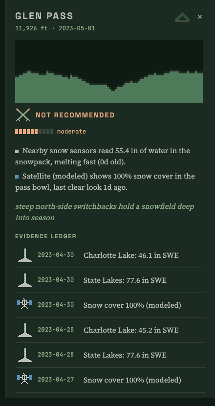

# Sierra Pass Report



Live demo: [snowline-me-599cefb9.vercel.app](https://snowline-me-599cefb9.vercel.app/?pass=glen&date=2023-06-15)

Every Eastern Sierra backpacker asks the same question from May to August: can I get over the pass this weekend, and do I need an ice axe? The honest answer is scattered across SNOTEL telemetry, CDEC snow pillows, USGS stream gauges, satellite snow cover, and thousands of forum posts written by people with wildly different risk tolerances. Sierra Pass Report fuses all four streams into a per-pass status with a confidence grade that admits what it does not know, and every sentence in the panel traces back to the sensor curve or the exact forum quote it came from.

## Architecture

```
gazetteer/         15 passes: polygons, aliases ("the pass after Rae Lakes" -> Glen)
ingest/
  snotel.py        NRCS AWDB REST, daily SWE and depth
  cdec.py          California's CDEC snow sensors (the network that actually covers this crest)
  usgs.py          NWIS daily discharge + 15-minute diurnal melt pulse
  satellite.py     NDSI sampling over pass polygons + the modeled demo generator
  forums.py        scrapers plus the curated demo corpus
extraction/        Claude reads trip reports into a null-heavy JSON schema,
                   resolves entities, calibrates reporter bias by register
fusion/            pure Python: reliability priors x recency decay -> status,
                   confidence from evidence density and agreement, conflicts surfaced
store/ + db/       raw-first storage; SQLite locally, Postgres+PostGIS DDL for production
pipeline.py        orchestrates everything into web/public/data/*.json
web/               Next.js + MapLibre, forest palette, pixel evidence glyphs,
                   the 96x32 data-generated pass vignette
```

Data flow is raw-first: every fetch lands in `raw_fetches` exactly as received before any parsing, so the whole pipeline can be reprocessed from disk. Every observation row carries provenance back to its raw fetch, station, or post.

The two-tier model: everything above works with zero configuration because the LLM extractions ship in the repo, cached by post content hash. Add an Anthropic API key (env var for the pipeline, or the in-app field which stores it only in your browser) and the live features light up: paste any trip report and watch it become structured evidence, and ask a pass questions answered strictly from its evidence ledger.

## Extraction accuracy

One honest number beats ten features: field-level accuracy of `claude-haiku-4-5` extraction against 30 held-out hand-labeled posts (`eval/labeled.jsonl`, scored by `eval/run_eval.py`):

```
location             100.0%   (scored by resolved gazetteer slug)
date_observed         96.7%
snow_condition        90.0%
traction_used         83.3%
crossing_condition    93.3%
exposure_comfort      70.0%
reporter_register     66.7%
quote_span           100.0%   (verbatim-substring check)

overall               87.5%
```

The first eval round scored 82.9%. The misses were concentrated in `reporter_register`: the model inferred "experienced" from competent tone while the labels demanded explicit markers. One prompt revision aligned the annotation guideline with the model (markers only, tone is not evidence) and the cache key gained a prompt-version salt so the stale extractions could not linger. One iteration, then stop; tuning further against 30 posts would just be memorizing them. The two fields still under 75% are the two genuinely subjective ones, which is worth knowing before trusting any single report.

## What was hard

**SNOTEL does not cover the southern Sierra.** The brief said SNOTEL, and SNOTEL proper links exactly one station to one of the fifteen passes. California runs its own network (CDEC); Charlotte Lake sits 1.2 km from Glen Pass at 10,400 ft. So CDEC became the primary snow stream, discovered from a candidate list against live station metadata because CDEC has no JSON station index, only an HTML page to parse. The messiest data in the mountains starts with the station directory.

**The diurnal melt pulse lives in a different API than the flow data.** Most Eastern Sierra gauges publish only daily means, and the melt pulse (afternoon discharge swinging 30 to 50 percent above the morning) is only visible in 15-minute instantaneous values, which most local gauges do not serve. The pipeline takes the swing where it exists and degrades to daily means where it does not, which is exactly the kind of partial evidence the fusion layer was built to admit.

**Reporter bias is a real modeling problem.** A PCT thru-hiker's "fine" and a first-timer's "terrifying" can describe the same snowfield. The extractor infers each reporter's register from explicit markers only (trail names, "forty years in this range", "my first pass"), and the calibration layer remaps their adjectives onto one severity scale before fusion: first-timer terror is damped, thru-hiker understatement is boosted. The first eval round taught the model and the labels to agree on what "experienced" even means: tone is not evidence, markers are.

**Honesty had to be designed in, not bolted on.** Demo satellite observations are derived from the sensor melt curve (NSIDC needs authenticated downloads a public repo cannot assume), so every such row says `satellite:modeled` in its provenance and the UI labels it modeled. Where streams disagree, the panel says so in an alpenglow callout instead of averaging the disagreement away, and disagreement costs confidence points.

## Setup

```bash
python3 -m venv .venv && .venv/bin/pip install -e ".[dev]"
.venv/bin/pytest                          # unit tests
.venv/bin/python -m scripts.backfill      # refresh sensor data (live APIs, no key)
.venv/bin/python pipeline.py              # fuse and export for the web app
cd web && npm install && npm run dev      # http://localhost:3000
```

Optional LLM work (extraction of new posts, eval):

```bash
cp .env.example .env                      # add ANTHROPIC_API_KEY
.venv/bin/python -m scripts.extract_corpus --engine api
.venv/bin/python -m eval.run_eval
```

The GitHub Actions cron (`.github/workflows/ingest.yml`) refreshes sensor data daily and re-exports; the API key secret is optional there too.

33 passes covered, Cottonwood to Vogelsang: the JMT/PCT chain (Forester, Glen, Pinchot, Mather, Muir, Selden, Silver, Donohue and friends), the eastside escape routes (Kearsarge, Bishop, Piute, Taboose, Sawmill, Baxter, Shepherd, Mono, Duck), the southern country (Trail Crest, New Army, Cottonwood, Colby, Franklin, Sawtooth, Kaweah Gap, Elizabeth, Granite), the cross-country classics (Lamarck Col, Italy, Pine Creek, Hell For Sure, McGee), and the Yosemite high country (Parker, Vogelsang).

The data window runs from the 2023 monster snow year through today: every melt season is ingested in full, and the daily cron rebuilds the store from the live APIs each morning, re-fuses, and redeploys, so "today" on the scrubber is always the mountain as the sensors currently see it. The SQLite store itself stays out of git because it is reproducible from the APIs; the LLM extraction cache (`data/extractions/cache.jsonl`) is the one paid-for artifact and ships committed.

Not a safety product. Conditions change by the hour up there; read the primary sources this thing links you to, and make your own call at the base of the chute.
